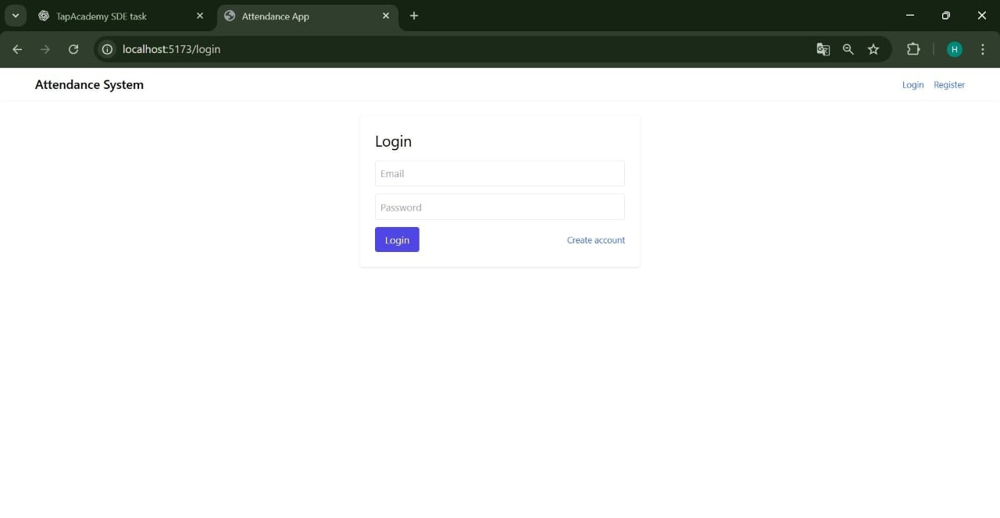
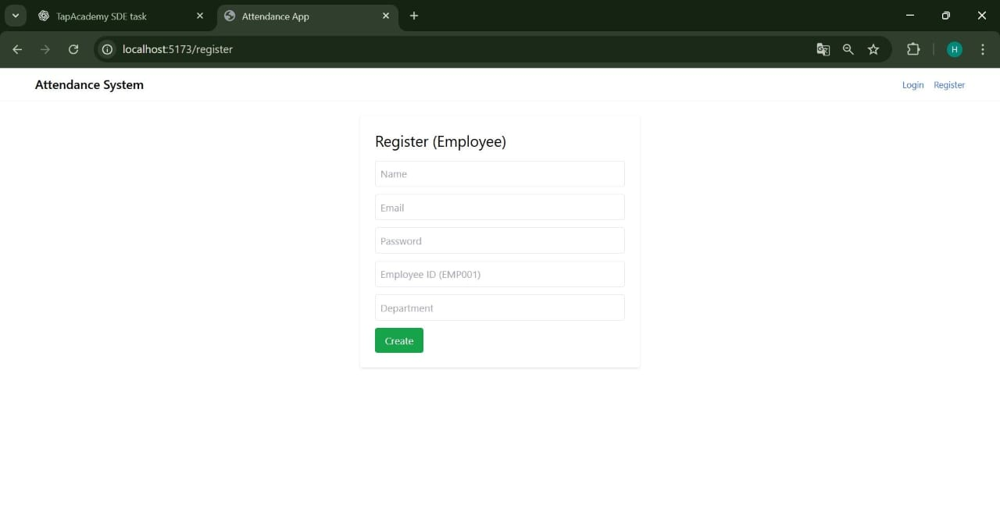
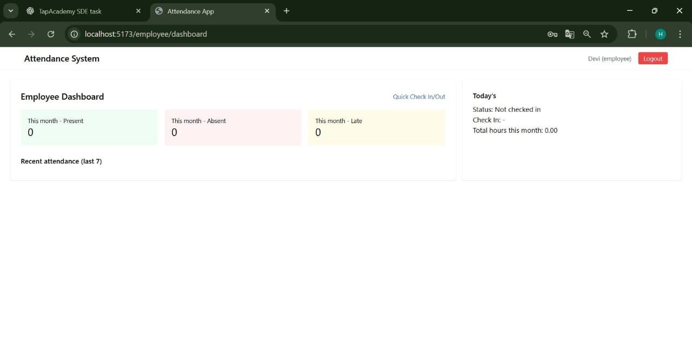
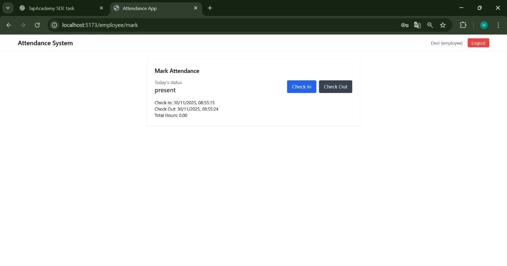
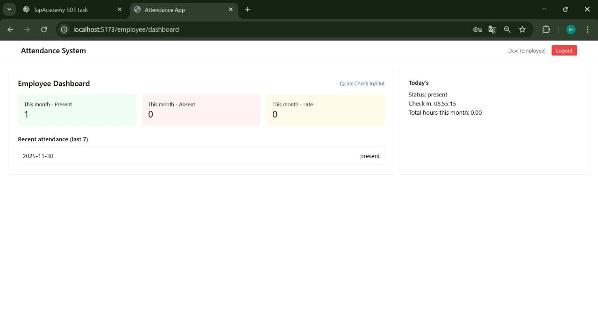
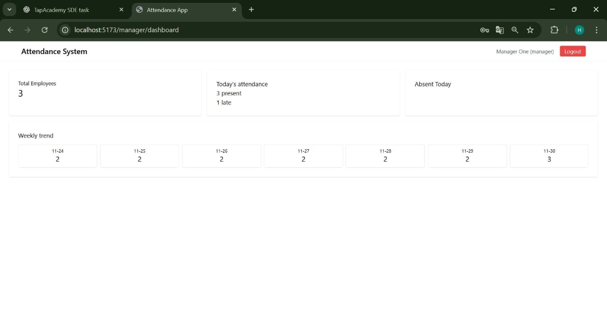

# Employee Attendance System

A full-stack Employee Attendance System with role-based access for Managers and Employees.  
This project was created for TapAcademy SDE Intern Round 2 Task.

Frontend uses **React + Redux Toolkit + TailwindCSS**,  
Backend uses **Node.js + Express + MongoDB**,  
Full system can run using **local Node/Mongo** or **Docker Compose**.

---

## 🚀 Features

### 👨‍💼 Manager
- Login  
- Manager Dashboard (total employees, present today, absent count)  
- View All Attendance Records  
- Export Attendance as CSV  
- Team Calendar (placeholder UI)

### 👤 Employee
- Register and Login  
- Check-In  
- Check-Out  
- View My Attendance History  
- View / Edit Profile

---

## 🧩 Tech Stack

### Frontend
- React  
- Vite  
- Redux Toolkit  
- Tailwind CSS  
- Axios  

### Backend
- Node.js  
- Express  
- MongoDB & Mongoose  
- JWT Authentication  

### DevOps
- Docker  
- Docker Compose  
- Nginx for static frontend hosting  

---

## 📁 Folder Structure

```
attendance-system/
│── backend/
│ ├── controllers/
│ ├── models/
│ ├── routes/
│ ├── seed/
│ ├── server.js
│ ├── package.json
│ └── Dockerfile
│
│── frontend/
│ ├── src/
│ ├── index.html
│ ├── package.json
│ └── Dockerfile
│
│── docker-compose.yml
│── README.md
```

---

## 🔧 Prerequisites

- Node.js v16+  
- npm  
- MongoDB (local installation or Docker)  
- Optional: Docker Desktop  

---

## ⚙️ Environment Variables

Create a `.env` file in **backend/**:

PORT=5000
MONGO_URI=mongodb://mongo:27017/attendance_db
JWT_SECRET=supersecret_demo


If running without Docker:
MONGO_URI=mongodb://localhost:27017/attendance_db


In **frontend/** create `.env`:

VITE_API_URL=http://localhost:5000/api

---

# ▶️ Local Development (No Docker)

## 1. Backend Setup
```bash
cd backend
npm install
node server.js
```

Backend runs on:
http://localhost:5000

## 2. Frontend Setup
```bash
cd frontend
npm install
npm run dev
```

Vite runs on:
http://localhost:5173

---

## 🧪 Seed Database (Required)

Run:
```bash
cd frontend
npm run seed
```

This creates:
- Manager
  ```css
  manager@company.com  
  password123
  ```
- Sample Employees

---

## 🐳 Docker Setup (Recommended)

This runs Mongo + Backend + Frontend together

1. Start all containers
   ```bash
   docker-compose up --build
   ```
Frontend → http://localhost:5173

Backend → http://localhost:5000

2. Seed inside backend container
   ```bash
   docker exec -it attendance-system-backend-1 npm run seed
   ```

3. Stop containers
   ```bash
   docker-compose down
   ```

---

## 📸 Screenshots

Below are some screenshots of the application for reference.

### 🔐 Authentication
**Login Page**  


**Register Page**  


---

### 👤 Employee Dashboard
**Employee Dashboard**  


**Mark Attendance**  


**My Attendance History**  


---

### 👨‍💼 Manager Dashboard
**Manager Dashboard Overview**  


**All Attendance Records**  


**Export Attendance CSV**  


---

### 🐳 Docker (Optional)
**Docker Containers Running**  


---

## 🧪 API Endpoints

### Auth

| Method | Endpoint             | Description             |
| ------ | -------------------- | ----------------------- |
| POST   | `/api/auth/register` | Register new employee   |
| POST   | `/api/auth/login`    | Login and receive JWT   |
| GET    | `/api/auth/me`       | Get logged-in user info |

### Attendance

| Method | Endpoint                     | Description                    |
| ------ | ---------------------------- | ------------------------------ |
| GET    | `/api/attendance/today`      | Today's attendance             |
| POST   | `/api/attendance/checkin`    | Check In                       |
| POST   | `/api/attendance/checkout`   | Check Out                      |
| GET    | `/api/attendance/my-history` | Employee attendance history    |
| GET    | `/api/attendance/all`        | Manager: all users' attendance |
| GET    | `/api/attendance/export`     | Export CSV                     |

---

## ❗ Troubleshooting

Frontend not loading (Connection Refused)

- Frontend container not running

- Run:
  ```bash
  docker ps
  docker-compose up --build frontend
  ```

Backend cannot connect to MongoDB

- Mongo container may be down

- Run:
  ```bash
  docker ps
  ```

Login / Check-In shows 401

- Token missing in localStorage

- Login again

- Check Application → Local Storage → token

---

## 📦 Ready for GitHub

To push this project:
```bash
git init
git add .
git commit -m "Initial commit"
git branch -M main
git remote add origin https://github.com/USERNAME/attendance-system.git
git push -u origin main
```

## 📦 Deliverables

1. **GitHub Repository with Clean Code**  
   - Well-structured backend and frontend  
   - Proper folder structure, comments, and modular code  
   - `.gitignore` included for Node, Vite, Docker

2. **README.md**  
   - Setup Instructions  
   - How to Run (Local & Docker)  
   - Environment Variables  
   - Screenshots  
   - Author Info & Contact  

3. **.env.example File**  
   - Sample environment variables for backend and frontend  
   - No sensitive data included  

4. **Working Application**  
   - Fully functional Employee Attendance System  
   - Check-In / Check-Out  
   - Manager Dashboard  
   - CSV Export  
   - Role-based routing  

5. **Seed Data**  
   - Manager account  
   - Sample employees  
   - Optional sample attendance records  
   - `npm run seed` script available  

---

## 🙌 Acknowledgements

Special thanks to:

- **TapAcademy** for providing the SDE Intern challenge  
- **Faculty and mentors** at Rise Krishna Sai Gandhi Group of Institutions  
- Open-source developers of React, Redux Toolkit, Node.js, Express, MongoDB, and Docker  
- TailwindCSS and Vite communities for fast development workflow  

This project is developed by **Seelam Harikadevi** as part of the  
**TapAcademy SDE Intern – Round 2 Task**.

---

## 👩‍💻 Author

**Name:** Seelam Harikadevi  
**College:** Rise Krishna Sai Gandhi Group of Institutions  
**Contact:** +91 7288911807  

---

## 📝 License

This project is licensed under the **MIT License**.  
You are free to use, modify, and distribute this software for educational and personal projects.
